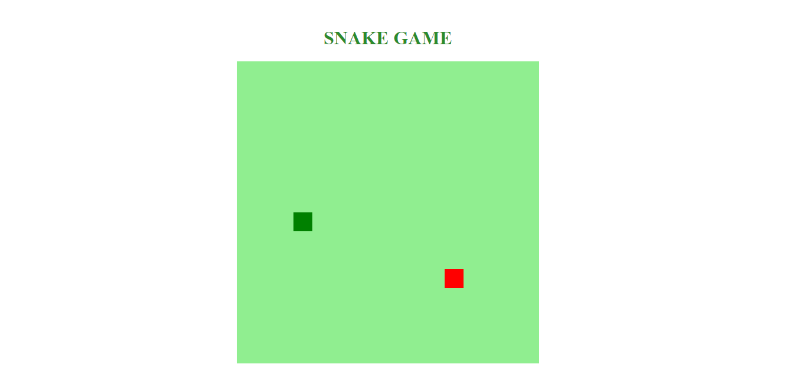
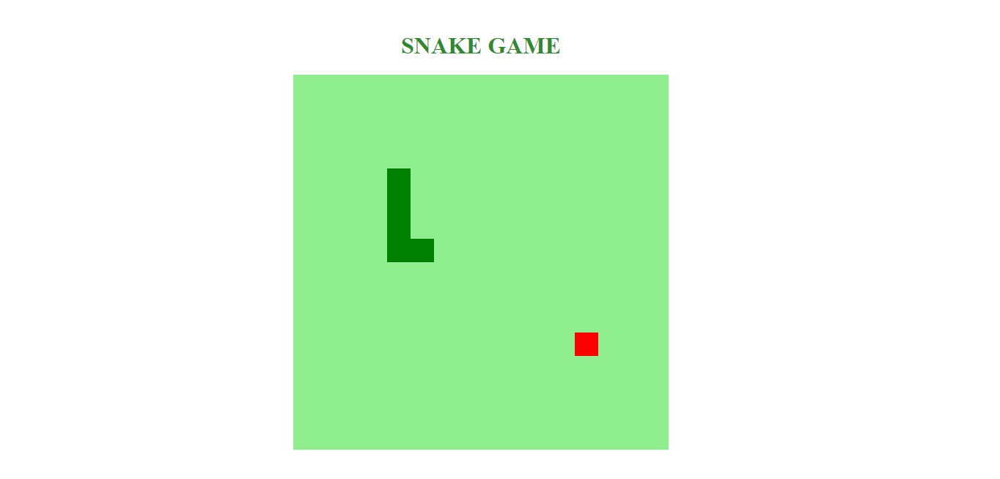
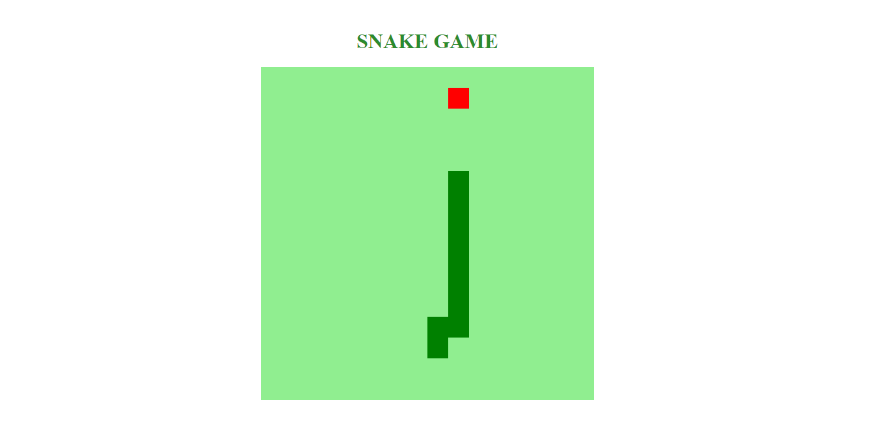
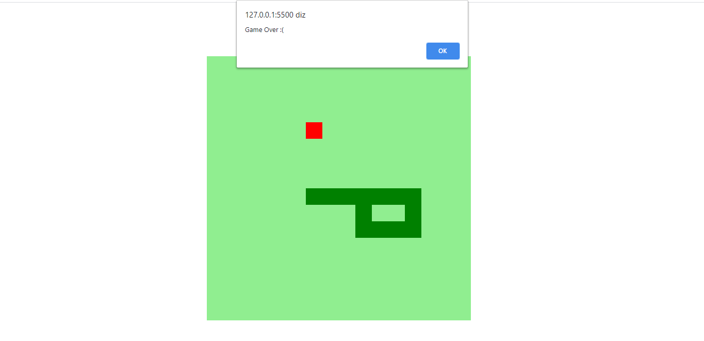

[](https://github.com/marioandre01)
[](#)
[](https://github.com/marioandre01/jogo_da_cobrinha-dio/stargazers)
[](https://github.com/marioandre01/jogo_da_cobrinha-dio/network/members)
[](https://github.com/marioandre01/jogo_da_cobrinha-dio/graphs/contributors)
[](https://github.com/marioandre01/jogo_da_cobrinha-dio/blob/master/LICENCE.md)


<h1 align="center">
    Jogo da cobrinha - DIO
</h1>

<p align="center"> 
  <a href="#-projeto">Projeto</a>&nbsp;&nbsp;&nbsp;|&nbsp;&nbsp;&nbsp;
  <a href="#-tecnologias">Tecnologias</a>&nbsp;&nbsp;&nbsp;|&nbsp;&nbsp;&nbsp;
  <a href="#-layout">Layout</a>&nbsp;&nbsp;&nbsp;|&nbsp;&nbsp;&nbsp;
  <a href="#-executando-a-aplicação">Executando a aplicação</a>&nbsp;&nbsp;&nbsp;|&nbsp;&nbsp;&nbsp;
  <a href="#gear-contribuição">Contribuição</a>&nbsp;&nbsp;&nbsp;|&nbsp;&nbsp;&nbsp;
  <a href="#memo-licença">Licença</a>
</p>

## 💻 Projeto

Esse projeto foi desenvolvido através do bootcamp "HTML Web Developer" oferecido pela [Digital Innovation One - DIO](https://digitalinnovation.one/), orientado pela instrutora Gabriela Pinheiro.

O projeto teve como objetivo recriar o famoso jogo da cobrinha. Em seu desenvolvimento se criou uma área de backgroud onde está a parte jogável do jogo. Nela aparece a cobrinha e a comida que ela deve pegar para crescer. No começo do jogo a cobrinha já começa andando para a direita. Ao ir passando pela comida a cobrinha vai crescendo em um quadradinho de seu tamanho. No jogo ao passar do limite da área jogável a cobrinha aparece na parte oposta para o jogo continuar e ela não sair do jogo. Esse processo ocorre no eixo X e no eixo Y. O jogo termina quando a cobrinha tocar o seu próprio corpo, daí é "GAME OVER".


## 📋 Tecnologias

O projeto foi desenvolvido com as seguintes tecnologias:

- HTML
- CSS
- Javascript

## 🎨 Layout

<p align="center" style="background: #f8f8f8">
  
  
  
  
</p>


## 💻 Executando a aplicação

### Requisitos necessários

Para executar o projeto é necessário ter:
- Navegador web

### :octocat: Clonando o Repositório

```bash
$ git clone https://github.com/marioandre01/jogo_da_cobrinha-dio.git

# entre na pasta do projeto
$ cd jogo_da_cobrinha-dio
```
### 💻 Executando a aplicação

Abra o arquivo index.html

## :gear: Contribuição

Para contribuir com esse projeto faça os seguintes passos:

- Faça um fork desse repositório;
- Crie uma branch com a sua feature: `git checkout -b minha-feature`;
- Faça commit das suas alterações: `git commit -m 'feat: Minha nova feature'`;
- Faça push para a sua branch: `git push origin minha-feature`.

## :memo: Licença

Esse projeto está sob a licença MIT. Veja o arquivo [LICENSE](./LICENSE) para mais detalhes.
